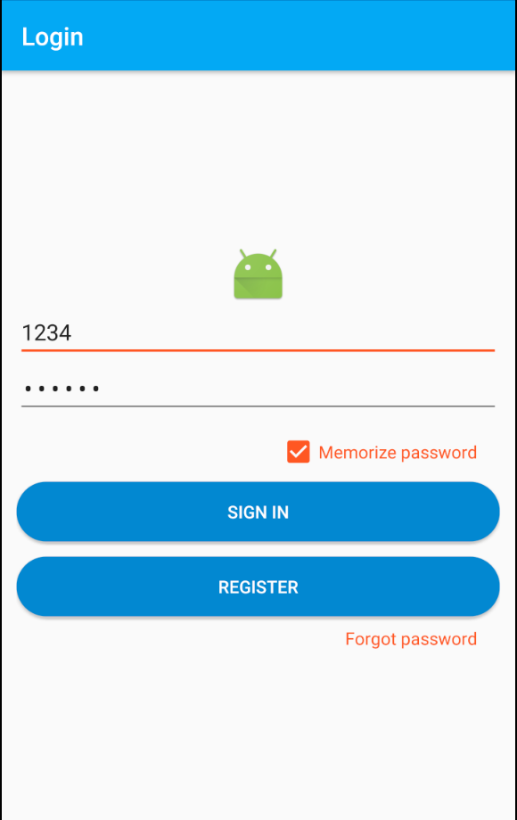
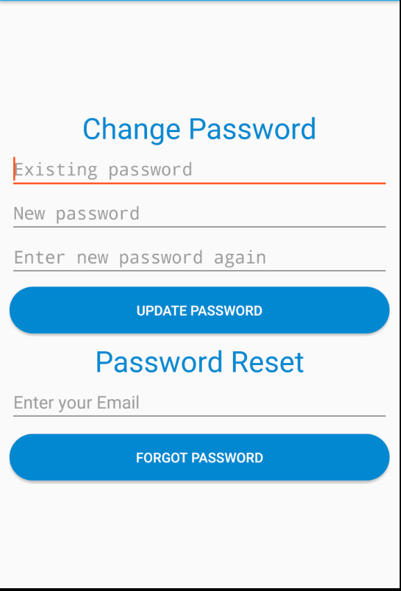
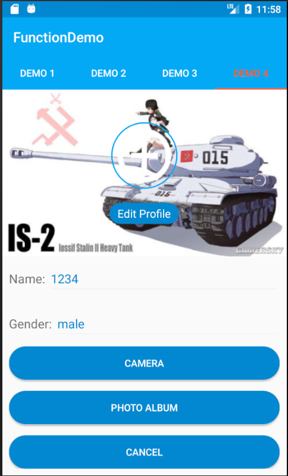
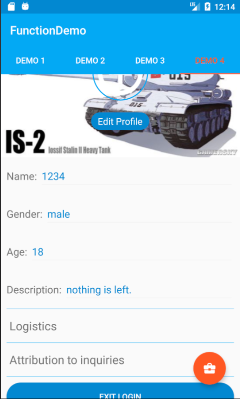
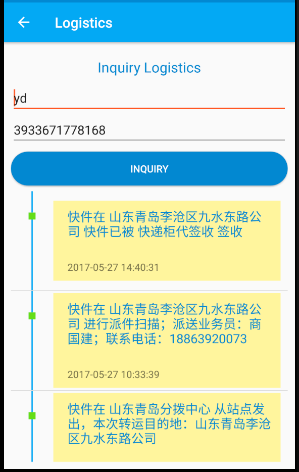
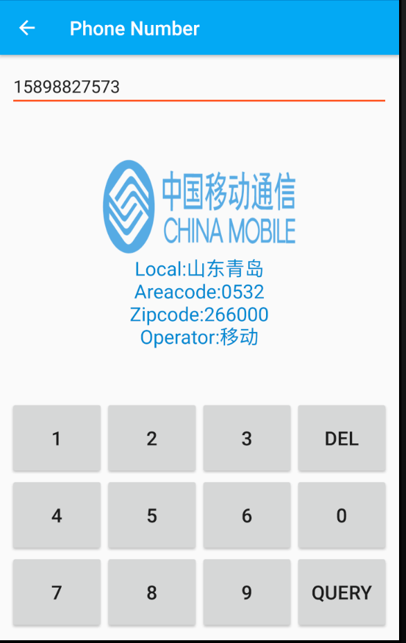
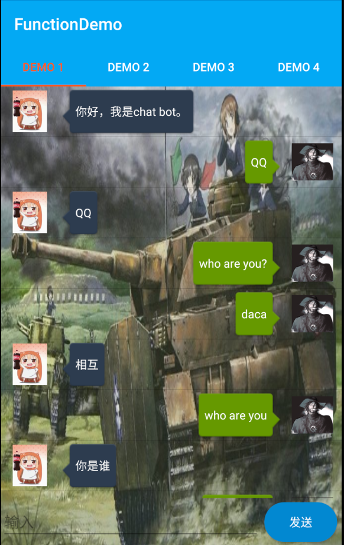

# FunctionDemo
## Implement some functions in a project(developing...)

### 1. Implement interface of Login by Bmob
Bmob:https://www.bmob.cn/

Function of Login was realized 
Function of Register was realized 
Function of remember username and password was realized 
Function of reset password in app was realized 
Function of reset password by verify email was realized 
#### Screenshots of Login

### 2. Implement User's settings in Demo4
CircleImageView: Get from https://github.com/hdodenhof/CircleImageView 
API of logistics: https://www.juhe.cn/docs/api/id/43 
API of no attribution to inquiries: https://www.juhe.cn/docs/api/id/11 

Function of using camera(Maxversion < android 7.0, version of 7.0 is developing) 
Function of custom dialog 
Function of open picture album 
Function of tailor pictures and set them as avatar 
Function of exit Login 
Function of inquiry Logistics' information when users click area of Logistics 
Function of no attribution to inquiries 
#### Screenshots of Demo4

### 3. Implement function of Chat bot in Demo1
API of Chat bot: https://www.juhe.cn/docs/api/id/112 
RxVolley: https://github.com/kymjs/RxVolley 

Function of Chat bot 

#### Screenshots of Demo1

